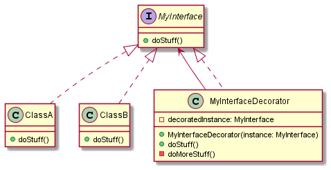

# Decorator

La **Decorator** est un design pattern structurel permettant d'étendre un comportement sans passer par l'héritage.

A partir d'un contrat d'implémentation, représenté sur le diagramme ci-dessus par une interface, un decorator vient prendre en paramètre de son constructeur une instance concrète respectant le contrat.

Le decorator lui-même respecte le contrat défini par l'interface.

On peut donc l'injecter comme une instance de classe normale (ici ClassA & ClassB). La seule différence est la présence de la méthode privée `doMoreStuff` : cette méthode peut amener une variance dans l'exécution de la méthode `doStuff`.

Ainsi, en plus d'exécuter la méthode `doStuff` de l'instance prise en argument de construction, on peut y ajouter un autre comportement.

Voir par exemple dans les sources, pour des classes implémentant `ILogger`, le decorator `LoggerDateTimeDecorator` vient ajouter la possibilité d'afficher la date, et ce quelque soit le type concret d'une instance `ILogger` (logger en majuscule ou logger en HTML).

> L'utilisation d'un decorator revient à privilégier la **composition** par rapport à **l'héritage**. Ce principe se retrouve dans beaucoup de frameworks ou librairies, par exemple les [Higher-Order Components](https://reactjs.org/docs/higher-order-components.html) dans ReactJS
