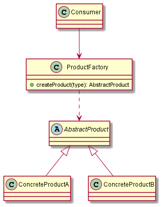

# Factory

La **Factory** est un design pattern créationnel permettant à un code client d'instancier un type concret différent suivant le contexte d'exécution de l'application, et ce de manière dynamique.

En effet, dans le diagramme ci-dessus :

- Le `Consumer` peut avoir besoin de manipuler des produits
- Il ne peut cependant deviner à l'avance quel(s) type(s) concret(s) de produit(s) il va manipuler

Il peut alors être intéressant de profiter d'un niveau d'abstraction supplémentaire pour les produits, en introduisant le type abstrait `AbstractProduct`, dont nos 2 classes concrètes de produits hériteront.

Ainsi, une `ProductFactory` aura pour responsabilité de créer un type de produit ou l'autre, suivant ce qui lui est demandé en paramètre. En revanche, la méthode chargée de créer le produit présentera, quant à elle, un type de retour `AbstractProduct` dans sa signature.

Finalement, du point de vue du `Consumer` :

- Il a toujours besoin de manipuler des produits
- Il dispose à présent d'une factory, interface unique lui permettant de disposer d'un `AbstractProduct`, tel que défini dans la signature de la méthode `createProduct`
- Il peut donc profiter d'un comportement polymorphique en accédant aux méthodes abstraites définies dans `AbstractProduct`
- Quel que soit le type concret de produit dont il dispose, il sait que c'est son implémentation concrète qui sera exécutée, ou bien un comportement commun hérité de la classe abstraite

> Dans les sources, le `Consumer` est simplement la page `index.php`. Cela pourrait être un service, ou tout autre composant de l'application
