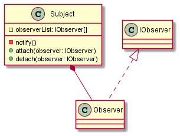

# Observer

L'**Observer** est un design pattern structurel permettant de découpler l'exécution de plusieurs comportements.

Un **sujet** détient une référence à plusieurs **observers**, respectant tous un contrat d'implémentation.

Depuis un code client, on a la possibilité d'instancier un sujet, puis de lui ajouter ou supprimer des observers.

Ainsi, quand on le décide, on peut dire au sujet de **notifier** l'ensemble de ses observers pour qu'ils s'exécutent.

> Le sujet peut également décider de notifier lui-même ses observers, par exemple s'il détient une variable d'état, qui peut changer, auquel cas, lors du changement de valeur, il peut déclencher la notification de ses observers

Une implémentation courante du pattern observer se retrouve dans la gestion d'**événements**. Lorsqu'un événement survient, on va indiquer à un **dispatcher** de transmettre l'information aux différents **écouteurs** qui pourraient être susceptibles d'écouter cet événement.

Dans ce cas, on pourra avoir affaire à des implémentations plus complexes, comme par exemple l'[Event Dispatcher](https://github.com/symfony/event-dispatcher/blob/5.2/EventDispatcher.php) de Symfony (listeners, subscribers, priorités, etc).
