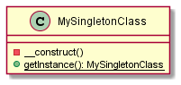

# Singleton

Le singleton est design pattern créationnel permettant de contrôler qu'on ne dispose que d'une seule instance d'une classe donnée.

Le diagramme ci-dessus présente un singleton "de base", mais, dans l'exemple se trouvant dans les sources, il peut évoluer légèrement.

Dans notre cas, nous contrôlons l'instanciation d'une connexion `PDO` à une base de données afin de ne pouvoir disposer que d'une seule connexion, même en cas de requêtes multiples.

Un service `TimeService` possède une dépendance envers l'instance de `PDO`, c'est pour ça que 2 instances distinctes sont créées. Des logs indiquent quand l'appel au constructeur du service est effectué, et donc l'appel au singleton.

> Les 2 aspects principaux à retenir sont le fait que le constructeur du singleton est rendu privé, afin qu'aucun code extérieur ne puisse instancier un objet de cette classe, et qu'une méthode statique est donc exposée (portée publique) pour permettre à tout code extérieur de récupérer l'instance de classe singleton. C'est ainsi la classe singleton elle-même qui détient la capacité d'instancier ou non le singleton
